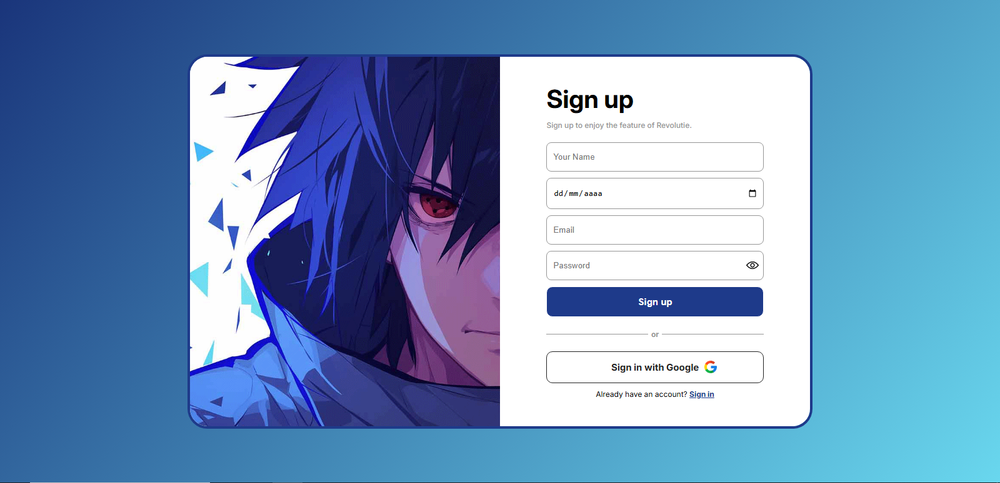
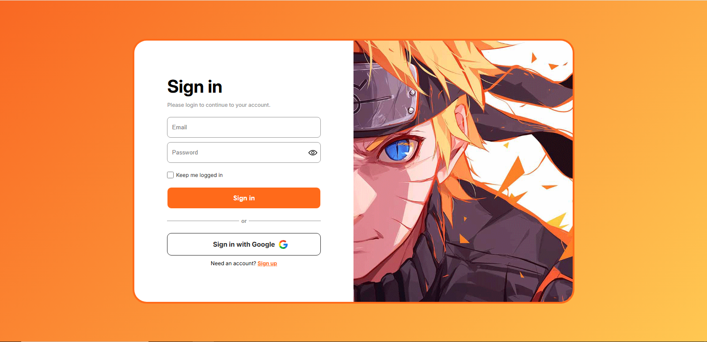

# Signup / Signin Toggle Form

Interface moderna de autenticação com alternância entre telas de cadastro e login, incluindo troca de tema visual e responsividade.

## 🚀 Demonstração

Projeto desenvolvido com foco em UI/UX, simulando o fluxo de autenticação de aplicações reais.

## 🌐 Acesse o projeto
https://signup-signin-toggle-form.vercel.app

## ✨ Funcionalidades

* Alternância entre **Sign up** e **Sign in**
* Sistema de **troca de tema visual (Naruto / Sasuke)**
* Layout **totalmente responsivo**
* Botão de **mostrar/ocultar senha**
* Simulação de login com Google
* Animações suaves na transição de telas

## 🛠️ Tecnologias utilizadas

* HTML5
* CSS3
* JavaScript (Vanilla JS)

## 🎯 Objetivo do projeto

Este projeto foi desenvolvido com o objetivo de praticar:

* Manipulação de DOM com JavaScript
* Criação de interfaces interativas
* Responsividade com CSS
* Organização de código frontend

## 📱 Responsividade

O layout foi adaptado para diferentes tamanhos de tela, garantindo boa usabilidade em dispositivos móveis e desktops.

## 📸 Preview

### -Sign Up-



### -Sign In-



## 📦 Como executar

```bash
# Clone o repositório
git clone https://github.com/seu-usuario/signup-signin-toggle-form

# Abra o arquivo index.html no navegador
```

## 🧑‍💻 Autor

Luciano Nóbrega Alves de Oliveira
